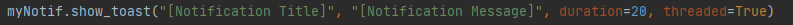
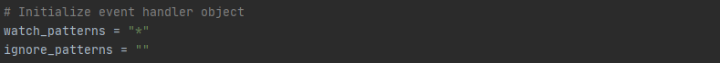
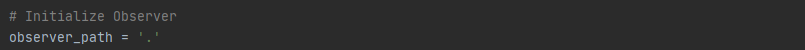

# DirectoryNotification
A simple python script that watches a directory and displays a windows notification when a file is:

    * Created
    * Deleted
    * Modified
    * Moved
I wanted to watch all these events for my drive but feel free to remove the events that you don't want to watch for your specific use. Just need to remove the specific functions and remove their respective assignment to the event handler in main().
## Table of Contents
* [Background](#Background)
* [Dependencies](#Dependencies)
* [Resources](#Resources)
* [Setup](#LocalStep)
* [Some Extra Stuff](#SomeExtraStuff)
* [ToDo](#ToDo)

## Background
I am in the process of teaching myself python scripting. This project was my first attempt
at a meaningful project. I have a network drive set-up on a RaspberryPi that I use to share files between my different computers, so I don't have to keep track of a flash drive. This notification project displays a windows notification when a file in my shared drive is created, deleted, modified, or moved.

## Dependencies

    win10toast
    watchdog
    time
## Resources
* [Windows-10-Toaster-Notifications]

## LocalStep
1) Install All Dependencies

		pip install -r requirements.txt

2) Change Toast Notification Details
	* Enter a title and message for the notification
	

3) Change Event Handler Details
	* The code as-is handles all types of patterns given the value of the `watch_patterns` variable and does not have ignore any patterns.
	* To watch for specific patterns such as (*.txt, *.csv, *.docx, etc.) change the `watch_patterns` variable value to the patterns of your choice
	* To ignore specific patterns change the `ignore_patterns` variable value to the patterns of your choice
	

4) Change Observer Path
	The code as-is watches for file changes in the current directory given the `observer_path` variable
	* To observe a specific directory change the `observer_path` variable value to the path of your choice
	

5) Run the File
	`python Notif.py`
	* Once it runs the terminal with be in a loop watching the specified directory

6) Test Out the Notification
	* Create a new file of the type you are watching for and save it to directory that your observer is watching.
	* Once it is saved, you should see a notification with your title and message

## SomeExtraStuff
* If you want, you can customize the Toaster Notification with your own icon
	* In the `show_toast` function call, add the argument `icon_path = <PATH_TO_YOUR_ICON>`.
	* Replace`<PATH_TO_YOUR_ICON>` with the actual path where your icon is stored. This will change the icon for your notification to your own personal icon when it is displayed.
	* **NOTE:** Your icon must be an `*.ico` file type or it won't work. When I first started this project, I tried to use a `.png` and I kept getting an error until I did some research and found I was using the incorrect file type.

## ToDo
* I want to run this script every time I log into my computer, so I will eventually create a batch file and place it in my startup folder to ensure it runs when I log in.

[Windows-10-Toaster-Notifications]: <https://github.com/jithurjacob/Windows-10-Toast-Notifications>
